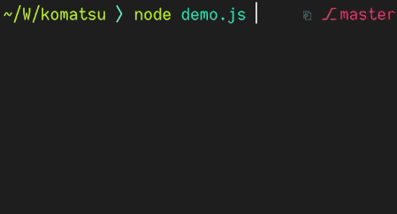

# 🌲 komatsu

the parallel spinner logger with the fresh pine scent



## usage

`npm install komatsu`

```js
const Komatsu = require('komatsu')
const logger = new Komatsu()

// a unique label. logging again with the same label overwrites the line
logger.log('label', {
	status: 'pending', // the default. or, 'done', 'info' or 'fail'
	message: 'a nice message',
	error: new Error(`i'll print the stack trace`),
})
```

while any logger is `pending`, new loggers (with a label that hasn't been seen yet) will appear on the next line. once all current loggers are no longer `pending`, i'll clear a line. if i'm the only thing that's running timers, node will exit. otherwise, any loggers will appear after the empty line (even if their label was used before).

## the name

小松 ko-matsu means "small pine tree". it's also a city in Ishikawa prefecture and the name of a company that makes forestry equipment.

## licence

ISC. &copy; Kara Brightwell
